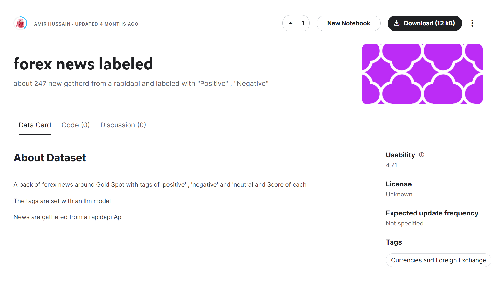
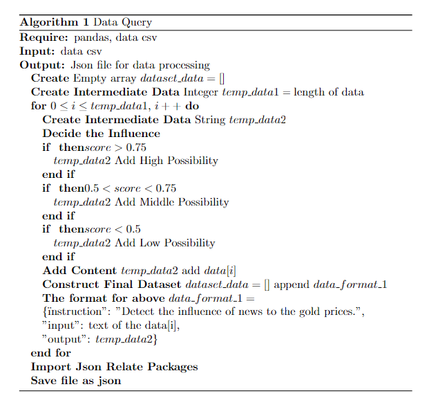
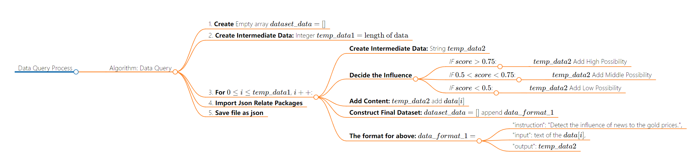

# Code
## Data Download
- Download from https://www.kaggle.com/datasets/ahsh37/forex-news-labeled
- 
## Description
- The data query process begins by importing a dataset into Python using Pandas, reading a CSV file, and transforming it into a JSON file. The code initializes an empty list for storing data and iterates through each dataset row, creating a structured output from designated columns. This structured data is organized into a dictionary and added to the list. Subsequently, the list, containing the structured data, is written into a JSON file using the json.dump method. This methodology is not restricted to Python; it highlights the universal steps of data manipulation—read, process, and export—adaptable to other languages like Java and Go by adjusting syntax while maintaining the core process of data handling.
## pseudo-code

```
\begin{algorithm}
    \caption{Data Query}
  \begin{algorithmic}
    \REQUIRE pandas, data csv
    \INPUT data csv
    \OUTPUT Json file for data processing
    \STATE \textbf{Create} Empty array $dataset\_data=[]$
    \STATE \textbf{Create Intermediate Data} Integer 
 $temp\_data1=\text{length of data}$
    \FOR{$0 \leq i\leq temp\_data1$, $i++$}
      \STATE \textbf{Create Intermediate Data} String $temp\_data2$
      \STATE \textbf{Decide the Influence} 
      \IF $score>0.75$
      \STATE $temp\_data2$ Add High Possibility
      \ENDIF
      \IF $0.5<score<0.75$
      \STATE $temp\_data2$ Add Middle Possibility
      \ENDIF
      \IF $score<0.5$
      \STATE $temp\_data2$ Add Low Possibility
      \ENDIF
      \STATE \textbf{Add Content} $temp\_data2$ add $data[i]$
      \STATE \textbf{Construct Final Dataset} $dataset\_data=[]$ append $data\_format\_1$
      \STATE \textbf{The format for above} $data\_format\_1=$
        \STATE\{\"instruction": "Detect the influence of news to the gold prices.",
        \STATE"input": text of the data[i],
        \STATE"output": $temp\_data2$\}
        \ENDFOR
        \STATE \textbf{Import Json Relate Packages}
        \STATE \textbf{Save file as json}
  \end{algorithmic}
\end{algorithm}
```
## Flowchart
