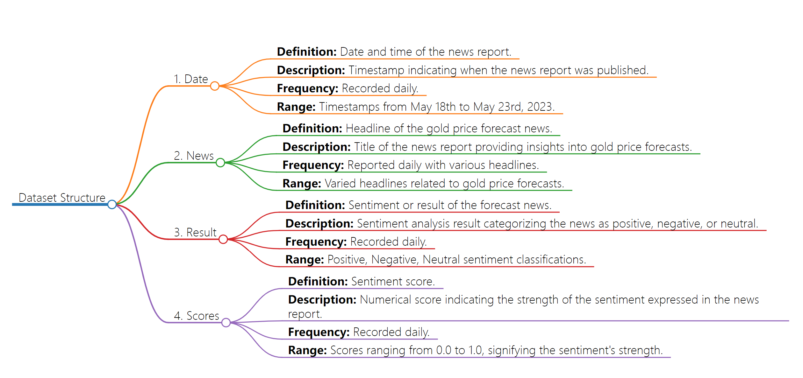

# Data
## Data Download
- https://www.kaggle.com/datasets/ahsh37/forex-news-labeled
## Description
- The dataset captures gold price forecasts and related news. It encompasses varied sentiments and predictions around XAU/USD rates. The news headlines reflect a blend of negative, neutral, and occasionally positive stances, influenced by factors like US debt ceiling talks, Fed speeches, and Dollar strength. Predictions range from bearish sentiments projecting downside movements to more optimistic forecasts hinting at potential rebounds or stability. The sentiment scores accompanying each forecast suggest the confidence level or strength of the sentiment expressed. Overall, the data encapsulates the volatility and sensitivity of gold prices to geopolitical and economic factors during this period, providing a snapshot of the market sentiment and its influence on XAU/USD rates.
## Data Dictionary

| Variable   | Definition                                | Description                                                          | Frequency | Range                              | Unit      | Type   | Sample Observation                                           |
|------------|-------------------------------------------|----------------------------------------------------------------------|-----------|-------------------------------------|-----------|--------|--------------------------------------------------------------|
| Date       | Date and time of the news report          | Timestamp indicating when the news report was published              | Daily     | May 18th to May 23rd, 2023         | N/A       | String | Thursday, 18 May 2023 23:39:45                                |
| News       | Headline of the gold price forecast news  | The headline or title of the gold price forecast news                | Daily     | Various                             | N/A       | String | Gold Price Forecast: XAU/USD stays bearish...                |
| Result     | Sentiment or result of the forecast news  | Sentiment analysis result (positive, negative, neutral)             | Daily     | Positive, Negative, Neutral        | N/A       | String | Neutral                                                      |
| Scores     | Sentiment score                           | Numerical score indicating the strength of the sentiment            | Daily     | 0.0 to 1.0                         | N/A       | Float  | 0.6031550765037537                                          |

#### Notes:
- **Definition:** The variable's name.
- **Description:** Brief explanation of the variable.
- **Frequency:** How often the variable is recorded (e.g., daily, hourly).
- **Range:** The possible values the variable can take.
- **Unit:** Measurement unit, if applicable.
- **Type:** Data type of the variable (e.g., String, Float).
- **Sample Observation:** An example of a data point within the variable.
## Flowchart
- 