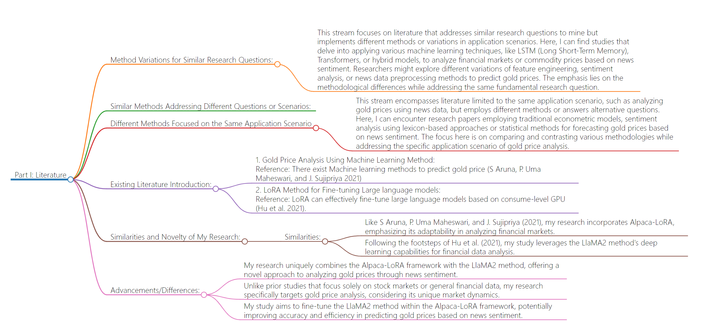

# Part I: Literature
## Method Variations for Similar Research Questions:
- This stream focuses on literature that addresses similar research questions to mine but implements different methods or variations in application scenarios. Here, I can find studies that delve into applying various machine learning techniques, like LSTM (Long Short-Term Memory), Transformers, or hybrid models, to analyze financial markets or commodity prices based on news sentiment. Researchers might explore different variations of feature engineering, sentiment analysis, or news data preprocessing methods to predict gold prices. The emphasis lies on the methodological differences while addressing the same fundamental research question.
## Similar Methods Addressing Different Questions or Scenarios:
This stream explores literature that uses comparable methods to analyze financial markets or commodities but focuses on different questions or application scenarios. For instance, I can discover studies utilizing the LlaMA2 method, or its variants, for analyzing various commodities or stock prices using news sentiment analysis. The focus here is on how similar methods can be adapted to address distinct questions related to different commodities or financial instruments.
## Different Methods Focused on the Same Application Scenario
- This stream encompasses literature limited to the same application scenario, such as analyzing gold prices using news data, but employs different methods or answers alternative questions. Here, I can encounter research papers employing traditional econometric models, sentiment analysis using lexicon-based approaches or statistical methods for forecasting gold prices based on news sentiment. The focus here is on comparing and contrasting various methodologies while addressing the specific application scenario of gold price analysis.
## Existing Literature Introduction:
1. Gold Price Analysis Using Machine Learning Method:
Reference: There exist Machine learning methods to predict gold price (S Aruna, P. Uma Maheswari, and J. Sujipriya 2021)
2. LoRA Method for Fine-tuning Large language models:
Reference: LoRA can effectively fine-tune large language models based on consume-level GPU (Hu et al. 2021).
## Similarities and Novelty of My Research:
### Similarities:
- Like S Aruna, P. Uma Maheswari, and J. Sujipriya (2021), my research incorporates Alpaca-LoRA, emphasizing its adaptability in analyzing financial markets.
- Following the footsteps of Hu et al. (2021), my study leverages the LlaMA2 method's deep learning capabilities for financial data analysis.
## Advancements/Differences:
- My research uniquely combines the Alpaca-LoRA framework with the LlaMA2 method, offering a novel approach to analyzing gold prices through news sentiment.
- Unlike prior studies that focus solely on stock markets or general financial data, my research specifically targets gold price analysis, considering its unique market dynamics.
- My study aims to fine-tune the LlaMA2 method within the Alpaca-LoRA framework, potentially improving accuracy and efficiency in predicting gold prices based on news sentiment.
## Flowchart

```
@article{aruna2021prediction,
  title={Prediction of potential gold prices using machine learning approach},
  author={Aruna, S and Umamaheswari, P and Sujipriya, J and others},
  journal={Annals of the Romanian Society for Cell Biology},
  pages={1385--1396},
  year={2021}
}
@article{hu2021lora,
  title={Lora: Low-rank adaptation of large language models},
  author={Hu, Edward J and Shen, Yelong and Wallis, Phillip and Allen-Zhu, Zeyuan and Li, Yuanzhi and Wang, Shean and Wang, Lu and Chen, Weizhu},
  journal={arXiv preprint arXiv:2106.09685},
  year={2021}
}
```